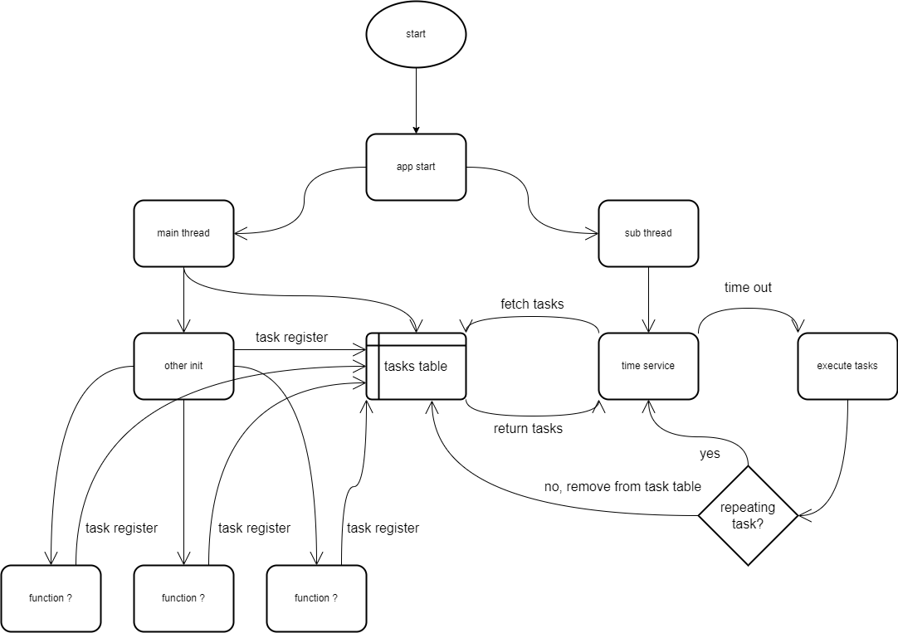

# Crank Development Guide Book

> @DAF201
> 
> [Email me](mailto:DAF201@blink-in.com)
>
> Find me in the ~~UTD~~ Richardson Public Library library 3rd-floor self-study section ~~near the network bookshelves~~ if you need (I am a college student)

# if you are here to find how to use my modules such as Modbus request or keypad to wrap up something, go to the last section directly.

# foreword
----
[[Now playing なんとかなるくない？(Nantokanarukunai?)]](https://www.youtube.com/watch?v=s2V1psqVdXA)

I am not here to teach you Lua, and I will assume you are familiar with Lua syntax, keywords, style, and grammar... Below, I will only go over things I found important, for other parts like metrics, connectors, and two searches in SDK, I will not explain how to use them. Also, before you start reading the remaining parts, you need to know:

----

1. The case sensitive is the difference between the simulator and the actual machine, don't name something like "variable = 0, VARIABLE = 1". It will not run correctly on an actual machine, and your co-works will want to punch you for sure.
2. When you found you are copying and pasting a chunk of code, stop and think about it.
3. When you found your function is longer than a screen, stop and think about it.
4. House is made out of frames and bricks, not decorations. Build necessary framework first then implements functions.
5. Don't copy variables around unless necessary.
6. Try to avoid using some APIs, they are slow (namely, gre.timer_set_interval).
7. It cannot print to the serial ports or ssh, you need to make your own print function.
8. unpack does not work correctly on crank Lua, which means function(...) will not work correctly
9. I cannot guarantee you will know how to make things work after reading, but this will help with making the project more flexible and stronger if you need to add new features in the future.
10. Try to make all the UI changes on the UI side using variable flags and binding, it is really complex on the Lua side to make UI changes.

# table of contents:

1. [some thing general](#something_general)
2. [UI structure and some important concepts](#UI_structure_and_important_concepts)
3. [system init](#system_init)
4. [customized functions](#customized_functions)
5. [task table](#task_table)
6. [data_structure](#data_structure)
7. [data_IO](#data_IO)
8. [some components that make life easier](#free_components)
9. [modules](#modules)

# something_general
----

[[Now playing Fresh Start (Squid Sisters)]](https://www.youtube.com/watch?v=ofQiYxuJCBc)

First of all, Crank is an embedded UI SDK. It allows you to make embedded projects much easier than hand writes every line of code. However, even if you don't have to hand write every line of code, it is still very important to keep the remaining parts "modular", "abstract", and "low coupling".

## keep things separate

For example, you have an update everything function that reads data from an external source, saves those data to variables, and displays those data on the screen. This function will be called every second.

Assume for some reason, a piece of data replay took very long. In this case, the function will be stuck on this piece of data, and the remaining data and updates will be stuck too.

A better solution is to separate fetch data, save data, and update screens into three functions, and use a timer to regulate them. (which is pretty much impossible in Lua cause Lua does not support threading. luckily, the event callback trigger is by the UI engine, you don't need to worry about when is the event going to come back).

<!--  -->


(this may not be a good example but just an general idea about what to do and what not to do)

## don't repeat yourself

Additionally, there is no sense to make a function for every button with similar outputs. For example, there are six values on the screen, and each of them has an add/sub button near it. There is no sense to write 12 functions such as value_1_add, value_1_sub, and value_2_add... instead, just make value_change(value_path, operation, amount), where value_path represents which value you want to change, and operation represents add/subtract, the amount represents how many you want to add/subtract to it.

<!--  -->


(no one wants to see 12 functions doing the same thing with different "GLOBAL VARIABLES" within them)

Trust me, no one wants to read such a thing. You are not here to enum out all possible results

<!--  -->
.png)

## clarity is everything

Naming is a super important part of software programming. A well-named variable/function should be clear and short if the condition allows. The long long name is acceptable as long as the purpose is clear and easy to understand. Also, it is okay to name something pathlike if necessary.

```lua
-- this function will be called when the application starts
function AppStart(mpargs)
end
-- path-like keys, not recommended but only when necessary, as they are from the UI path
action_register_map = {
    ["viscosity_layer.b1_buttons_group1.input_hysteresis_control.text"] = {40022, 1}, -- visc and pressure of the barrels number
    ["viscosity_layer.b1_buttons_group1.b1_input_cutout_control.text"] = {40023, 1},
    ["pressure_layer.b1_buttons_group1.input_hysteresis_control.text"] = {40024, 1},
    ["pressure_layer.b1_buttons_group1.b1_input_cutout_control.text"] = {40025, 1},
    ["viscosity_layer.b2_buttons_group1.input_hysteresis_control.text"] = {40026, 1},
    ["viscosity_layer.b2_buttons_group1.input_Cutout_control.text"] = {40027, 1},
    ["pressure_layer.b2_buttons_group1.input_hysteresis_control.text"] = {40028, 1},
    ["pressure_layer.b2_buttons_group1.input_Cutout_control.text"] = {40029, 1},
    ["viscosity_layer.b3_buttons_group1.input_hysteresis_control.text"] = {40030, 1},
    ["viscosity_layer.b3_buttons_group1.input_Cutout_control.text"] = {40031, 1},
    ["pressure_layer.b3_buttons_group1.input_hysteresis_control.text"] = {40032, 1},
    ["pressure_layer.b3_buttons_group1.input_Cutout_control.text"] = {40033, 1},
    ["viscosity_layer.b4_buttons_group1.input_hysteresis_control.text"] = {40034, 1},
    ["viscosity_layer.b4_buttons_group1.input_Cutout_control.text"] = {40035, 1},
    ["pressure_layer.b4_buttons_group1.input_hysteresis_control.text"] = {40036, 1},
    ["pressure_layer.b4_buttons_group1.input_Cutout_control.text"] = {40037, 1},
    ["Configuration_layer.BOM_control.text"] = {40063, 5}, -- bom string
    ["Configuration_layer.SerialNumber_control.text"] = {40068, 4}, -- serial number string
    ["Configuration_layer.StoreID_control.text"] = {40072, 3}, -- store ID string
    ["Compressor_layer.OnDelay_control.text"] = {40042, 1}, -- compressor on delay time number
    ["Compressor_layer.HoldOff_control.text"] = {40043, 1}, -- compressor hold off time number
    ["fan_hold_layer.Time_control.text"] = {40044, 1} -- fan hold off time number
}
-- check external source communication by heartbeat packages
function heartbeat_status_check()
end
```

Some bad naming examples, which will cause your co-workers' blood pressure to raise sky high

```lua
-- okay what is CB? your naming is not a standard or universal common sense
function CBInit(mapargs)
end
-- don't leave space in any type of naming even string key
data_barrel_1["beater motor"] = 0
data_app["powerSaverStart1"] = 0
data_app["powerSaverStart2"] = 0
data_app["powerSaverStart3"] = 0
data_app["powerSaverStart4"] = 0
data_app["powerSaverStart5"] = 0
data_app["powerSaverStart6"] = 0
data_app["powerSaverStart7"] = 0
data_app["powerSaverStart8"] = 0
data_app["powerSaverEnd1"] = 0
data_app["powerSaverEnd2"] = 0
data_app["powerSaverEnd3"] = 0
data_app["powerSaverEnd4"] = 0
data_app["powerSaverEnd5"] = 0
data_app["powerSaverEnd6"] = 0
data_app["powerSaverEnd7"] = 0
data_app["powerSaverEnd8"] = 0
-- I prefer something like this
data_app["power_saver"] = {
    { 0, 0 }, --slot 1, first value is start and second value is end
    { 0, 0 }, --slot 2...
    { 0, 0 },
    { 0, 0 },
    { 0, 0 },
    { 0, 0 },
    { 0, 0 },
    { 0, 0 }
}
-- for those highly related things, just put them in an array or table
```

Also, for those really cost tons of times task, I will suggest pass it to backend and let backend handle that (task time >=3s in my opinion, except internet requests or violent break into a hash). Because backend use a task-inquester

# UI_structure_and_important_concepts
----

Before moving on, there is another very important part you need to be very familiar with, the structure of the UI.

A basic view of the structure of the UI should be just like below

<!--  -->


It looks very complex, but we don't need to get into every single part of it, only those important parts.

### screen

Yes, a screen is a screen, a whole screen. Your full screen will be filled with the items on the screen you are at.

### layer 

A section on the screen, and you can have as many layers as you need on the same screen. However, layers will overlap with each other. The layer on the top will cover the layer at the bottom, which will result in you can only see the layer on top. In addition, the layer can be larger than the screen size, but only the section within the screen will be displayed. (also the layers are shared between screens, so you can't have two layers with the same name but doing different things)
the larger part is the screen, the smaller part is the layer belong to this screen

<!--  -->
.png)

### control

Then here comes the important part, that controls, the smallest unit you must have to display something or do something by touching the screen (you cannot just have an image on screen).

just like layers belong to the screen, and control must have a layer, and it will follow the display status of the layer (which means if you hide the layer, all controls belonging to this layer will be "hide" even if they are set to "show").

For each control, to display something, you will need to add "render extension", then we can start inserting elements (mostly images or text).

<!--  -->
.png)

<!--  -->
.png)

### variable

As it's named, it is a variable, and it can store a value of its type. However, this is one of the most important parts of the whole article, because it is the channel connecting the UI display, data, and external source. (it may belong to the application itself also rather than control only)

For each image or text in a control, we can assign a variable to it, and its display will automatically change with the variable. Each element can only be linked to one variable, but the same variable may be linked to many different elements (just like a function, each x only has one and only one y, but a y can have many x).

Below is how to link a variable to an element

Click on the eye-like button, click create a variable

<!--  -->
.png)

Assign a value to it (optional, but suggested cause you want something like default value to display when the connection is down)

<!--  -->
.png)

Then you will see a variable under the value of the element and within the control.

<!--  -->
.png)

Why is the UI variable so important? Because you can get/modify this variable using Lua APIs and a varible path, the UI display will also change at the same time.

```lua
-- get value from this path
gre.get_value(string_value_path)
-- change a value at this path to something...
gre.set_value(string_value_path, any_type_value_that_match)
-- image value is a string relative path that points to an image in the current project's images folder 
-- ./images/image_name.img_type (project_folder/images/image_you_want)
```

Also, trying to display nil (Null, None, nptr, just such thing in other languages) will cause the system to crash, so value check before the pass in.

### action

An action is something to do when an event happens (On the UI side, mostly touch, press, release, the application started, or such internal events. We will talk about the custom events in the data IO section).

When an action is triggered by an event, it will do something. It can play an animation, change a variable, jump to another screen, call a Lua function, and many others things. Most of the time, we will only use those I mentioned.

below is an example of a press action, it will call the Lua function hello_world when I click on the control (which is the image after the application start)

<!--  -->
.png)

<!--  -->
.png)

<!--  -->
.png)

you can also make it trigger by other events or doing other things. 

However, when you try to pass value in Lua function, your values are passed in as a table, you will need to take values out from table before use (and all of them passed in as string by default).

```lua
function table_parameter(mapargs)
    local str = mapargs.string
    print(str)
end
```
.png)
.png)

### event

The event is a concept of the happening of something. An event will have its name, data type, and data. Event has three types, self event, incoming event, and outgoing events.
 
A self event is something that happened to the application or screen. An example is the press event. In most cases, we only need small parts of the self-events, and mostly for buttons. commonly used self events include :"touch", "press", "release", "application start", and "screen show".

An incoming event is an event that comes from outside of the application. The main purpose of this type of event is to update data or execute external commands.

An outgoing event is an event that sends out from the application. The main purpose of this type of event is to make changes to an external source or let an external source execute commands.

we will talk about incoming and outgoing events in detail in data_IO.

add custom event

<!--  -->
.png)

# system_init
----

Now we are moving on to the system initialization section, below is the process of the system initialization I redesigned for [brix](https://github.com/DAF201/intern_2022/tree/main/brix).

<!--  -->


The main purpose of the system initialization is to ensure the UI is displaying correctly, and the services are started.

As people always say, "a good beginning is half done", as the entrance of the application, the system initialization is one of the most important parts. The structure of the initialization directly influences the efficiency of the application when running.

The initialization can be split into two parts, the data update and the start-up of the service. 

Data updates include screen updates and variable updates. Screen update is updating the status of the screen, such as which screen should we go to when the application starts, which part of the screen should be shown, and which parts of the screen should be hidden (even we can set those in UI, sometimes we still need some curtain like things to show on application start, but we don't want curtain to block our eyesight when developing). The variable update is changing the variables stored in the controls or application, which will change the display on the screen or let Lua get different data later (which usually makes no sense, except for some flag variables stored in the application. Cause mostly those variables are used and manipulated by services).

Then we have the service start up. Service is not a concept defined by the crank, instead, it is my personal defined concept. According to my definition, a service is a separately running function from the main thread that provides a service for the main thread. Crank Lua does not support coroutine or threading, but it has something similar Actually Lua itself does not support threading at all. Why do I mention this? Because the crank provides some C APIs to do that (Looks like C but I can not guarantee how the crank made those).

Like before, I am going to provide some examples of the services. 

<!--  -->


The timer service is a function that runs separately from the main thread. It will fetch all the tasks being registered in the task table from the main thread or other services, and execute the task by the time it reaches the task's schedule. After each execution, it will check if the task is a repeating task. If not, it will unregister this task from the task table.

A funny fact, the crank has build in timer and threading by it self, which are: 

``` lua
-- make an function execute every interval ms
id = gre.timer_set_interval(interval,function)
-- stop the repeating of function executation
gre.timer_clear_interval(id)
-- create a thread
gre.thread_create(function)
```

However, I will say use those APIs as less as possible. Those built-in threading will slow down the application. The creation of new thread costs, the switches between threads costs, and the running of threading costs. There are costs everywhere when you have too many threads. When I got the Brix, every timed function was called by the "gre.timer_set_interval", and the system was quite slow (the communication part took very long to react, the events were lost some time, and the clock was not loaded correctly sometimes). Later, I decided to rewrite the structure, then I have the structure above (But I will still say keep only necessary parts, I intergraded other services such as heartbeat service which check communication status as tasks into registered tasks to speed it up). 

# customized_functions
----

[[Now playing ハローディストピア(hello dystopia)]](https://www.youtube.com/watch?v=ye2J__KE9Yg)

Finally, we reached the coding part, so let's start with a hello world, every great project start form hello world.

Suddenly, you realize: "where in the world am I going to put my functions?" The SDK doesn't look like a text editor at all.

<!--  -->
.png)

So let's start from zero to one.

Firstly, we always want to have a function that starts when the application starts. So we go to the application, right-click the project, click add action

<!--  -->
.png)

Then, we select event: application start, action: Lua script, and type in "app_start" as function name, then click "edit"

<!--  -->
.png)

It will say something like the function does not exist, do you want to create it? click yes, then you will see it create a "callback.lua" with a

```lua
--- @param gre#context mapargs
function app_start(mapargs)
--TODO: Your code goes here...
end
```

<!--  -->
.png)

we change it to

```lua
function app_start(mapargs)
    print("hello world")
end
```

Now we can test the code, after we got an entrance. It will print a "Hello world" on console when application starts (right bottom).

<!--  -->
.png)

And we can start with building out system initialization and services with this entrance. You will start your system initialization and services startup from this app_start function (Still structure is important, don't put everything together [[to my system init]](#system_init)).

For those custom functions, you can put them all in this "call_back.lua" (which you shouldn't), or right-click on the script section, new to create a new script. However, you need to add a requirement in "callback.lua" to access them since "callback.lua" is the only entrance.

```lua
-- I created a test.lua with a test_function_from_test_dot_lua function inside it
test=require("test")
--- @param gre#context mapargs
function app_start(mapargs)
    print("hello world")
end
```

Then you can access your function via events such as button touch manually to interact with the user.

you can go to the project path, scripts folder, and create scripts manually but what is the point of doing that...

<!--  -->
.png)

# task_table
----

I pulled this part out cause I think it is important. STOP adding a bunch of gre.timer_set_interval or gre.thread_create (this thing doesn't even support arguments)

You need to come up with a task management service yourself. The quality of this part will directly influence the overall premormance.

Here is an example of task timer

```lua
-- this is a time based task table. you can make a id based table too, that will be easier but a litt bit slower than time based
--time counter
local timer_counter = 0;
Task_table = {}
--print table
function dump(o)
    if type(o) == 'table' then
        local s = '{ '
        for k, v in pairs(o) do
            if type(k) ~= 'number' then
                k = '"' .. k .. '"'
            end
            s = s .. '[' .. k .. '] = ' .. dump(v) .. ','
        end
        return s .. '} '
    else
        return tostring(o)
    end
end
--let this run in a while true in seprate thread or use gre set an interval to it
function Clock()
    if timer_counter > 65536 then
        timer_counter = 0
    else
        timer_counter = timer_counter + 1
        if #Task_table == 0 then
            return
        else
            for interval, function_table in pairs(Task_table) do
                if timer_counter % interval == 0 then
                    for index, functions_value in pairs(function_table) do
                        if not pcall(functions_value[1], functions_value[3], functions_value[4], functions_value[5]) then
                            print("error when running: " .. functions_value[1])
                        end
                    end
                end
            end
        end
    end
end
function Task_register(func, id, interval, args1, args2, args3)
    if Task_table[interval] == nil then
        Task_table[interval] = { { func, id, args1, args2, args3 } }
    else
        table.insert(Task_table[interval], #Task_table, { func, id, args1, args2, args3 })
    end
end
function Task_unregister(id)
    for interval, function_table in pairs(Task_table) do
        for index, functions_value in pairs(function_table) do
            if functions_value[2] == id then
                table.remove(function_table, index)
            end
        end
    end
end
--add tasks
Task_register(print, "print", 1, "test ", "1", " 2")
Task_register(print, "print2", 1, "test ", "3", " 4")
--windows debug
while true do
    Clock()
    if timer_counter > 10 then
    
    --remove tasks
        Task_unregister("print")
        
    end
    os.execute("powershell sleep 1")
end
--end of debug
```
output
```lua
test    3        4
test    1        2
test    3        4
test    1        2
test    3        4
test    1        2
test    3        4
test    1        2
test    3        4
test    1        2
test    3        4
test    1        2
test    3        4
test    1        2
test    3        4
test    1        2
test    3        4
test    1        2
test    3        4
test    1        2
test    3        4
test    1        2
test    3        4 --I unregistered print("test", 1, 2) after a certain times of calling
test    3        4
test    3        4
test    3        4
test    3        4
test    3        4
test    3        4
test    3        4
```

So basically, you will need to make such a thing somewhere to make a separate task calling system from the main thread, and register tasks and unregistered tasks from the main base on conditions. This will make life much easier than waiting for a slow/blocking task to go off in the main or make mutiple threads to handle tasks.

Also, for those extremely complex tasks which take tons of sources and time(>=3s), I will suggest passing them to the backend. Because the backend is created in C language, it will be faster and allows you to use the real threading. With threading, you can create a suspect-inspector model (which is basically a function timeout system. I have trouble remembering things so I prefer a weird name, it helps me distinguish different terms).

Everything below runs in a separate thread from the main thread, and the timer is another separate thread.

<!--  -->


# data_structure
----

let me draw a conclusion here. I don't see there is any point to save multiple copies of the same variables around unless you are making a backup or so. For the keypad, if the keypad is designed well, it should have a keypad buffer to store temporary data instead of directly making changes to real value.

now continues with preach, avoid storing global variables unless necessary.

the current data structure of Brix when initialize is just like

current design          |  my opinion
:-------------------------:|:-------------------------:
Why are we having a Lua "proxy"? | Just directly read everything to UI
|
<!--  |   -->

and the current data structure at the data update parts is like

current design          |  my opinion
:-------------------------:|:-------------------------:
|
<!--  |   -->

I am really confused about why are we having global tables everywhere, and the over brief naming brought me lots of trouble.

```lua
data_barrel_1["temp"] = 0
--okay, what is this temp for? We have like 3 or 4 temperatures that need to be displayed on different sections on UI for barrel 1
```

Things will be much cleaner if we just store variables straight into the UI variable because the UI variable is stored in the path.

```lua
-- this is where the data_barrel_1['temp'] goes to. As a path, you can see where the data is being used in UI.
-- And we can just change the value of the UI variable using gre.set_value(path, value)
gre.set_value(current_conditions_layer.b1card_group.Temp_Measure.text, 0)
```

It is just much much better for me to have a path-like thing to let me know what is this variable means to use for.

<!--  -->
.png)

So, just store everything you need in UI application screen, and get and change via

```lua
--set value
        gre.set_value(path,value)
--get value
        value = gre.get_value(path)
```

But for table, just try to reduce usage of global tables and name them clearly, save yourself and others time.

Yes, it can save table too, but save table in lua is much easier.

Also, use a table for variables highly associated to save yourself and others time, because the table is more organized and easier to use when looping.

```lua
-- use table 
barrel_data = {
    { 0, 0, 0 }, --barrel_1 : {co2 , h2o , pressure}
    { 0, 0, 0 }, --barrel_2 : {co2 , h2o , pressure}
    { 0, 0, 0 }, --...
    { 0, 0, 0 }
}
-- instead of 
barrel_1_co2 = 0
barrel_1_h2o = 0
barrel_1_pressure = 0
barrel_2_co2 = 0
barrel_2_h2o = 0
barrel_2_pressure = 0
barrel_3_co2 = 0
barrel_3_h2o = 0
barrel_3_pressure = 0
barrel_4_co2 = 0
barrel_4_h2o = 0
barrel_4_pressure = 0
-- to make things more organized and easier to use for looping
```

<!--  -->
.png)

However, I don't have time to change those cause it is too messy and I am about to return to school soon. So just start to change the structure at the next project.
A short example of what I am talking about:

1. I have a variable Backend version I need to store a "08/15/2022" to it when initializing
2. I create a string variable in UI called Backend_version
<!--  -->
.png)

3. I copy the path of the UI variable and store the value to it using

```lua
gre.set_value("backend_version", "08/15/2022" )
```

4. Next time, when I need to use the backend version data, such as update screen display, I use

```lua
some_variable_name = gre.get_value("backend_version")
```

to take variables out from UI. And if we just directly bind this UI variable to display, we can now change the value shown on the screen which should be 08/15/2022 now.

# data_IO
----

The IO system of the Crank is like MQTT in my opinion. The communication system works like the one below (They call it Modbus).


I said it is just like MQTT cause when you are trying to send data to the backend from UI, you are actually letting UI send an "event" to the Channel, and the backend will get the event out from the channel, which is just like the "publish-subscribe" of MQTT.

With this structure, UI and backend are separate from each other. The UI only needs to send the outgoing event to the channel and do the next thing. It does not have to wait until the backend finishes the event and returns a result. Instead, it has a built-in event listener which listens for the incoming events and triggers callback functions.

This incoming modbus_ret event will trigger the Lua function "modbus_return" and pass the whole event to it as the parameter.

.png)

When we try to send an event, we need to make sure the event is already defined in UI(just like you need to declare variables in some languages like C/C++/Java). Now go to UI, click on the "edit all user custom events" on the top with a brown "e" icon.

----

Firstly, we need to give the event a name. The name of the event is the tag that allows the event listener to distinguish different events.

Then, we have the event type. Event type defines what is the purpose of an event, where "self" means something that happens to the board or UI, "outgoing" means something to be sent out from the UI, and "incoming" means something coming into the UI. Only "outgoing" type events can be sent out and "incoming" type events can be received.

Lastly, the event data labels are a type of formatting how the backend going to take data out from the event. It reminds me of the term "schema" of GraphQL. Both of them are some type of user-defined formatting to tell the receiving side what is being received and what are the data types of them.


Remainder: date takes more space(bits) must be placed frontier (except string which you cannot determine size). The auto sorting which enabled by default will sort for you, but you still need to write data in order when sending.

.png)

----

Finally, we reach the coding part, so lets start with sending event out.

First, we have those functions that can send event out

```lua

-- Don't use them directly unless you have a very strong feeling of I need this indeed

-- send event to channel, no data (like stop something when received a stop event)
gre.send_event(event,channel)

-- send event with data to channel (we will use this)
gre.send_event_data(event_name,format_string,data,channel)

-- send an event to a UI layer 
-- (I never used this cause I don't see what is the point of using it... 
-- I can just manipulate UI via function)
gre.send_event_target(event_name,target,channel)
```

However, it is not very smart to copy and pasted this around to where you need this, because it will be a calamity when maintaining. So we abstract out two functions from the sending:

```lua
--- get is a web programming term that means to send a request to get something from the server 
-- (usually an HTML file which is basically a web page)
function modbus_get(mapages)
...
end

-- post is another web programming term that means to send something 
-- to the server and let the server change/save it 
-- (change avatar, password, upload file...)
function modbus_post(mapagrs)
...
end
```

Then we pack up the "gre.send_event_data(event_name,format_string,data,channel)" into our function. Below is an example from Brix.

``` lua
-- I don't send get request from UI, so I didn't use table in get
-- If you don't know what am I talking about, see the last part of "action" 
-- in "UI structure and some important concepts"
function modbus_request(address, size)
    size = size or 1
    if is_dev == 0 then
      gre.send_event_data('modbus_r', '2u1 addr 2u1 size', {
        addr = address,
        size = size
      }, gBackendChannel)
    end
end

---@generic modbus_post #general function to post value
---@param address number#address of register
---@param size number#number of register to post
---@param data string#data to post
function modbus_post(address, size, type, data)
    print("I have a proof of this theorem, but there is not enough space in this margin")
end
```

Post is much longer due to it being triggered by the keypad, and needs to determine the type of data we are posting, but the idea is the same (and I will suggest using a path-register map to simplify your work).

The core part is like
```lua
if type == 0 then -- number
    gre.send_event_data('modbus_p', '2u1 addr 2u1 size 2u1 type 2u1 value', {
        addr = address, -- register address
        size = size, -- register size
        type = type, -- data type 0:number 1:string
        value = data -- int data: decimal
    }, gBackendChannel)
else -- string
    gre.send_event_data('modbus_p', '2u1 addr 2u1 size 2u1 type 1s0 value', {
        addr = address, -- register address
        size = size, -- register size
        type = type, -- data type 0:number 1:string
        value = data -- string data
    }, gBackendChannel)
end
```

As you see, the data part is a table that matches your labels, this is important. Then we can use those two functions to send events out.

----

Now for receiving, which is triggered by the build-in event listener.

Firstly, we need to have an event ready, which means go talk to whoever made the backend, or you can just compile a new one if you know how to use the C gre library (which I don't, I only made a halfway complete framework for backend).

Now I assume you have an event name from your backend, now we can move on to crate event.

.png)

Then we add an action to the event listener about what to do after receiving this event called modbus_ret (add to the application, don't just add to a random layer or control)

.png)
(ignore heart beat part, they belongs to heartbeat service which ensure the communication quality)

As you see, I add a Lua script to it. When the event listener received the modbus_ret, it will call this "modbus return" function with a table passed in. For this part, I really don't have any good way to abstract it, so just use if.. then .. return end.

Here is another important part, because I said I want to make this more abstract, I made a simple protocol with the backend. We split data by comma.

```lua
---@generic modbus_return #general function recieved events
---@param mapargs table#table of data of the event
function modbus_return(mapargs)

    --    this is a table | table pass in | event data | label of data
    --      ↓                   ↓               ↓               ↓
    local splited_data = split(mapargs.context_event_data.modbus_read_data, ',')
    --                     ↑
    --        not a build-in function, this is external. 
    --        It split string by delimiter and returns a table

    -- ... heart beat balabala

    modbus_return_execute(splited_data) -- execute/data analysis
end


-- structure of the splited_data, min size 3, expected size = number of register requested +2
-- splited_data = {
--     [1] = register_address: stringified unsigned_int,
--     [2] = register_size: stringified unsigned_int,
--     [3] = data1 : stringified any,
--     [4] = data2 : stringified any,
--     ...
-- }


-- as I said, I don't have a good solution to such thing yet, so "if then return end"
function modbus_return_execute(splited_data)
    -- check which register, for some mutiple register requestes, you may want to check data size
    if splited_data[1] == '40003' then 
        -- tobin is not built-in function, it will convert string hex to string binary for splitting later
        data_app['barrelcount'] = tonumber(tobin(splited_data[3]):sub(10, 12), 2) 
        data_app['language'] = tonumber(tobin(splited_data[3]):sub(3, 7), 2)
        data_app['time_from_cloud'] = tonumber(tobin(splited_data[3]):sub(8, 8), 2)
        data_app['compressor'] = tonumber(tobin(splited_data[3]):sub(9, 9), 2)

        -- part of init, to ensure this part of data were received before open the "curtain"
        reciving_flags[40003] = true

        -- remove from task table, because this part of data we only need it when init
        callback_unregister('modbus_request_40003')
        BarrelSetup() -- update barrel UI
        return
    end

    if splited_data[1] == '40004' then
        data_app['uvc4complete'] = tonumber(tobin(splited_data[3]):sub(12, 12), 2)
        data_app['uvc4failed'] = tonumber(tobin(splited_data[3]):sub(11, 11), 2)
        reciving_flags[40004] = true
        if data_app["firmwareUpdateInProcess"] then 
          if data_app['uvc4complete'] == 1 or data_app['uvc4failed'] == 1 then
            callback_unregister('modbus_request_40004')
            data_app["firmwareUpdateInProcess"] = 0
            hideFirmwareUpdateInProcess()
          end
        end
        
        return
    end

    ...

    -- I don't have any better method 
    -- (I tried the anonymous function table (so-called lambda in python), still very ugly)
end
```

You can come up with your event handler or protocol, but I believe you still have to use the event listener to call it anyway (unless you are using FIFO or building your own communication layer which I tried, but found is even slower). So, just stick with this for now.

And thankfully we are done with this preaching, for now.

[[Now playing インスタントヘヴン(Instant Heaven)]](https://www.youtube.com/watch?v=IrrF_bUE8yc)

# free_components
----

[[Now playing メリーバッドエンド(merry bad end)]](https://www.youtube.com/watch?v=kffrKgAN7tI)

Number keypad v2 (there is no char keypad cause I don't have time to make that, dealing with UI costs tons of time):
```lua
function keypad_init(mapargs) -- when touch the button,sync for the buffer with the old value
    gre.set_layer_attrs("number_input_v2", { -- layer show up
        ['hidden'] = 0
    })
    gre.set_layer_attrs("num_keypad_v2", {
        ['hidden'] = 0
    })

    local max = mapargs.max or 999 -- set upper boundary
    local min = mapargs.min or 0 -- set lower boundary
    local is_string = mapargs.value_is_string or 0
    local title = mapargs.title or 'title'
    local unit = mapargs.unit or 'unit'

    gre.set_value("max_value", max) -- set max and min
    gre.set_value("min_value", min)
    gre.set_value("target_path", mapargs.path) -- set keypad target
    gre.set_value("post_value_is_string", is_string) -- set input value type
    gre.set_value("number_input_v2.input_elements.buffer.text", gre.get_value(mapargs.path .. '.text')) -- set up input box buffer
    gre.set_value("number_input_v2.input_elements.title.text", title)--set up title
    gre.set_value("number_input_v2.input_elements.unit.text", unit)--set up unit
end

local value_table = { -- match up path and others
    ["Compressor_layer.OnDelay_control.text"] = {data_app["compressorondelay"], 44042, 1}, -- this kind of UI engine save a value, lua script save another copy of the same value is ridiculously stupid
    ["Compressor_layer.HoldOff_control.text"] = {data_app["holdofftime"], 44043, 1}
}

function keypad_button(mapagrs)
    local key = mapagrs.key -- the key being pressed
    local max = tonumber(gre.get_value("max_value")) -- set max and min values for input
    local min = tonumber(gre.get_value("min_value"))

    local buffer = gre.get_value("number_input_v2.input_elements.buffer.text") -- sync buffer value with the front end buffer

    if key == 'enter' then
        local target = gre.get_value("target_path") .. '.text' -- where to change
        gre.set_value(target, buffer) -- save buffer to frontend value
        value_table[target][1] = buffer -- save buffer to lua value(what a stupid structure)
        gre.set_layer_attrs("number_input_v2", { -- hide keypad
            ['hidden'] = 1
        })
        gre.set_layer_attrs("num_keypad_v2", {
            ['hidden'] = 1
        })

        if #value_table[target] ~= 1 then -- send modbus post
            modbus_post(value_table[target][2], value_table[target][3], tonumber(gre.get_value("post_value_is_string")),
                buffer)
        end
        return
    end

    if key == 'delete' then
        if #buffer ~= 1 then -- buffer(string) size larger then 1
            buffer = buffer:sub(1, #buffer - 1) -- remove the last char from buffer
            gre.set_value("number_input_v2.input_elements.buffer.text", tonumber(buffer)) -- sync input box value
        else -- buffer size is 1
            buffer = '' -- buffer empty
            gre.set_value("number_input_v2.input_elements.buffer.text", buffer) -- sync input box value
        end
        return
    end

    if key == 'cancel' then
        gre.set_layer_attrs("number_input_v2", { -- hide the keypad
            ['hidden'] = 1
        })
        gre.set_layer_attrs("num_keypad_v2", {
            ['hidden'] = 1
        })
        return
    end

    if tonumber(buffer .. key) > max or tonumber(buffer .. key) < min then -- out of boundary, not doing anything
        return
    end

    buffer = buffer .. key -- append the input value to buffer
    gre.set_value("number_input_v2.input_elements.buffer.text", tonumber(buffer)) -- sync input box

end
```

Unpack(don't ask me why doesn't this thing has build-in unpack, IDK):
```lua

--for lua lower than 5
function unpack(t, i)
    i = i or 1
    if t[i] ~= nil then
        return t[i], unpack(t, i + 1)
    end
end
--cannot handle nested tables

```

Hide via Lua(link the hide to a UI flag variable saves you tons of time, so don't use following method):
```lua
function get_hidden_test()
    gre.set_value("TEXT_BACKGROUND.bg.line4",tostring(control['hidden']))--0 is show 1 is hide
    gre.set_control_attrs("TEXT_BACKGROUND.bg",{['hidden']=1})--hide something via lua
end
```

Echo and dump(in real linux environment, print will not work):
```lua
function echo(string)
    print(string)-- for develop purpose
    os.execute('echo ' .. string .. '>/dev/ttySC0')--change last part to your path
end

-- dump a table to string, use with echo like echo(dump(table))
function dump(o)
    if type(o) == 'table' then
        local s = '{ '
        for k, v in pairs(o) do
            if type(k) ~= 'number' then
                k = '"' .. k .. '"'
            end
            s = s .. '[' .. k .. '] = ' .. dump(v) .. ','
        end
        return s .. '} '
    else
        return tostring(o)
    end
end
```

split and tobin(mostly for event receiving):
```lua
function split(s, delimiter)
    result = {};
    
    if s ~= nil then
      for match in (s .. delimiter):gmatch('(.-)' .. delimiter) do
          table.insert(result, match);
      end
    end
    return result;
end

function tobin(x)
    ret = ''
    while x ~= 1 and x ~= 0 do
        ret = tostring(x % 2) .. ret
        x = math.modf(x / 2)
    end
    ret = tostring(x) .. ret
    while (#ret < 16) do
        ret = '0' .. ret
    end
    return ret
end
```

heartbeat (a term from live stream technology to ensure connection vitality):
```lua
-- from callback.lua
--above is the AppStart

...

callback_register('heart_beat_deactive', heart_beat_deactive, 2) -- heartbeat deactive
callback_register('heartbeat_status_check', heartbeat_status_check, 1) -- heartbeat checking

...

-- from modbus_event.lua

...

function modbus_return(mapargs)
    local splited_data = split(mapargs.context_event_data.modbus_read_data, ',')

    if #heart_beat < 3 then
        if splited_data[3] ~= nil then
            heart_beat[#heart_beat + 1] = true -- append heart beat
        else
            heart_beat[#heart_beat + 1] = false -- invaild data
            return
        end
    else
        if splited_data[3] ~= nil then
            heart_beat[#heart_beat + 1] = true -- append heart beat and remove oldest heart beat
            table.remove(heart_beat, 1)
        else
            heart_beat[#heart_beat + 1] = false -- invaild data
            table.remove(heart_beat, 1)
        end
    end

    modbus_return_execute(splited_data) -- execute/data analysis

end

heart_beat = {true, true, true}
curtain_status = 0

function heartbeat_status_check()
    if #heart_beat == 0 then -- no heart beat
        gre.set_layer_attrs("commFailLayer", {
            ['hidden'] = 0
        })
        curtain_status = 1 --curtain close
    else
        if curtain_status == 1 and all(heart_beat) then --curtain closed and heart beat okay for 3s
            gre.set_layer_attrs("commFailLayer", {
                ['hidden'] = 1
            })
            curtain_status = 0 --curtain open
        end
    end
end

function heart_beat_deactive()
    if #heart_beat > 0 then
        table.remove(heart_beat, 1)
    end
end

...

```

A framework of backend with event timeout(unfinished):

[backend framework](https://github.com/DAF201/intern_2022/tree/main/backend%20framework)


Update script(usb manually update is slow):

```python

# you need to add "os.execute('ifconfig eth0 192.168.1.222 netmask 255.255.255.0')" in Lua init

from os import listdir,system
from os.path import isfile, join
from glob import glob
ip="192.168.1.222"
system("ping %s"%ip)
path="C:\Develop\Storyboard\Projects\Brix\export\scripts"
files = [files for files in listdir(path) if isfile(join(path, files))]
for file in files:
    system("scp %s/%s root@%s:/opt/middleby/brix/scripts"%(path,file,ip))#linux path
for file in glob("C:\Develop\Storyboard\Projects\Brix\export\*.gapp"):
    system("scp %s root@%s:/opt/middleby/brix/"%(file,ip))
system("ssh root@%s"%ip)
```
# modules
----


1. Keypad

To add a keypad to control, you need to go to UI and copy the path of where you are adding the keypad too.

Then, ensure you have variable name text with string type and linked to a render extension element

.png)

In the next step, copy the keypad_init from somewhere or create an action with touch as the event. Fill in your data.

.png)

(remeber to remove the "" copied from path)

You don't need to manually call up the keypad layer, that is included in the function (just ensure you have that layer).

This keypad is like C++, you need to set up the environment (which is very hard), but actual using is really easy. You need to have the following to make sure the keypad can run correctly.

.png)
.png)
.png)

Additionally, if you want to send post, you will need to add your path and other info to this table

.png)
(replace the data_app with gre.get_value in next project. I don't have time to make those large changes)

2. Timer task

Insert following to the beginning of your system init if you don't have it 

```lua
gre.timer_set_interval(clock, 1000) 
```

When you need to create a timed task, use

```lua

--       must be unique | function, no () | optional  |  optional
--                 ↓       ↓                    ↓           ↓
callback_register('id', function, interval, args1, args2, args3)
--                                   ↑              ↑
--                             int in second |  optional
```

To add to task table, all arguements are optional.

When you no longer need a task, use

```lua
callback_unregister('id')
```

To unregister it from task table

For example, I have a function to get something from 40003, and it must get data before init finish, then I add to ensure I got data at lease once:

```lua
callback_register('modbus_request_40003', modbus_request, 1, 40003) -- homescreen info registers
```

In modbus_execution function, in the executation part, I will add "callback_unregister('modbus_request_40003')" to remove it from task table

```lua
if splited_data[1] == '40003' then
        data_app['barrelcount'] = tonumber(tobin(splited_data[3]):sub(10, 12), 2)
        data_app['language'] = tonumber(tobin(splited_data[3]):sub(3, 7), 2)
        data_app['time_from_cloud'] = tonumber(tobin(splited_data[3]):sub(8, 8), 2)
        data_app['compressor'] = tonumber(tobin(splited_data[3]):sub(9, 9), 2)

        reciving_flags[40003] = true --init flags, don't worry about this

        callback_unregister('modbus_request_40003')
        BarrelSetup() -- update barrel UI
        return
end
```

3. modbus_rquest and modbus_post

Request means get in most of the cases... 

Before sending, make sure you have your channel ready somewhere:

```lua
gBackendChannel = "Your_Outgoing_Channel_name"
```

Now assume you have something to get, use:

```lua
-- both decimal int
modbus_request(starting_register_address, number_of_registers)
```

to send a get request to the backend (make sure the backend channel is also set correctly).

But most of the time, request get are sent by task table.

```lua
callback_register('modbus_request_40051', modbus_request, 4, 40051, 5) -- UVC4 Firmware Version
callback_register('modbus_request_40056', modbus_request, 4, 40056, 7) -- Model
callback_register('modbus_request_40063', modbus_request, 4, 40063, 5) -- BOM
callback_register('modbus_request_40068', modbus_request, 4, 40068, 4) -- SN
callback_register('modbus_request_40072', modbus_request, 4, 40072, 3) -- Store ID
```

For posting, currently, all of them were embedded in the keypad. If you want to send one for some reason, use:

```lua
-- address, size, type are int
-- data can be int or string base on type
-- type: 0 int, 1 string
modbus_post(address, size, type, data)
```

4. Heartbeat

Don't worry about this part yet. When you need it indeed, copy everything associated from callback and modbus_event of Brix and change some parameters. I am not sure do we still need such thing in next project.

5. FIFO

To be honest I am not very sure if should I put it here. But in case I tried this kind of thing before... You can use the backend to write data to FIFO directly, and UI keeps reading FIFO to get data. I will just say I don't recommend you to use this. Just like reading a normal file, but if you want to make both-direction communications, you will need two FIFO in different directions. Just to provide an idea.

```lua
function fifo_read() -- test use, for fifo
    test = io.open('/opt/middleby/brix/modbus_up', 'r')
    if test == nil then
        echo('file empty')
    end
    io.input(test)
    while 1 do
        string_value = io.read(4)
        if string_value ~= nil then
            echo('modbus data is : ' .. string_value)
        else
            echo('file is temporary empty')
        end
        -- case balabala :break
    end
    io.close(test)
end
```

6. Socket?

I noticed there is a TCP incoming event option earlier, but I don't have experience with Lua socket (only python). So I didn't try that. Maybe you can try to use a socket or HTTP to make a connection if you want I guess? It sounds really weird to me to connect to yourself, stranger than the fact I used to make a "clipboard network connection" between different languages.


7. Looper?

An alternative task table that executes one task at a time only, has not yet been added to Brix yet. THIS DOES NOT EXECUTE TASKS BY TIME OR ON TIME.

insert this to your callback.lua and system init function

```lua
looping = require("loop")
...
function system_init(mapargs)
    -- modbus_request_* type task timeout speed: 10 loops->1s by default,
    -- can change to other number, base on looping speed 
    task_timeout = 10
    -- you can change looping speed here, but it will also influence task_timeout
    gre.timer_set_interval(100, looper)
    ...
end
```

Append task to end of table.

```lua
-- id must be unique, 0 means repeat, 1 means 1 time execute, params are optional
append_to_loop(string_id, number_repeat_flag, function, param1, param2, param3, param4, param5)
```

Example of appending

```lua
--              id        function  param1... max of 5 params
append_to_loop("test1", 1, print, 'one time executation function test')
--                repeat? 0:true 1:false

append_to_loop("test2", 0, print, 'repeating executation function test')
```

Remove a task from the table. Don't try to remove 1 time execute the task(flag 1 task), they will be removed automatically after execution.

```lua
remove_from_loop(string_id)
```

Example of removing

```lua
--                  id
remove_from_loop("test2")
```
----

8. Language set

I need to declear this part is not mine first. 

Add those to your application when start part
```lua
    -- English is the application's base design language so we don't have
    -- to perform any loading initially. If we start with a different language
    -- then we should use loadOnInit to set those initial values.
    local attrs = {}
    attrs.language = "english"
    -- attrs.loadOnInit = true
    attrs.textDB = gre.APP_ROOT .. "/translations/translations.csv"
    attrs.attributeDB = gre.APP_ROOT .. "/translations/attributes.csv"

    Translation = VarLoader.CreateLoader(attrs)
```
then add this function to somewhere

```lua
function language_change(mapargs)
  local language=mapargs.language
  Translation:setLanguage(language)
  --local font=mapargs.font
  -- gre.set_value("your font variable",font) --optional, if your font can display all languages
end
```
then go to text translate panel to set up all translate text
when you need to change language, call language_change with language=your_language_here.

9. Variables translator(BETA)

TODO: TO FINISH

10. USB drive detect

add following to usb_detect.lua and import
```lua
local usb = {}
local current_devices = {}
local mounted_devices = {}
local init_devices = {}
local commands = {
    ['get_mount_info'] = 'lsblk | grep sd',
    ['get_usb_drives'] = 'blkid',
    ['devices'] = '/[%a%d%p]+/[%a%d]+',
    ['console'] = '>/dev/ttySC0',
    ['usb_drive_mount_point'] = '/run/media/',
    ['rmdir'] = 'rm -r ',
    ['find'] = 'find '
}

local function split(s, delimiter)
    local result = {};

    if s ~= nil then
        for match in (s .. delimiter):gmatch('(.-)' .. delimiter) do
            table.insert(result, match);
        end
    end
    return result;
end

local function dump(o)
    if type(o) == 'table' then
        local s = '{ '
        for k, v in pairs(o) do
            if type(k) ~= 'number' then
                k = '"' .. k .. '"'
            end
            s = s .. '[' .. k .. '] = ' .. dump(v) .. ','
        end
        return s .. '} '
    else
        return tostring(o)
    end
end

local function cout(str)
    print(dump(str))
    pcall(os.execute, { 'echo ' .. dump(str) .. commands['console'] })
end

local function exists(file)
    local ok, err, code = os.rename(file, file)
    if not ok then
        if code == 13 then
            return true
        end
    end
    return ok, err
end

local function isdir(path)
    return exists(path .. '/')
end

local function command_execution(cmd)
    local pipe_in = assert(io.popen(cmd, 'r'))
    local result = assert(pipe_in:read('*a'))
    pipe_in:close()
    return result
end

local function get_devices()
    local devices_buffer = {}
    for index, usb in pairs(split(command_execution(commands['get_usb_drives']), '\n')) do
        if usb ~= '' then
            devices_buffer[#devices_buffer + 1] = { string.gmatch(usb, commands['devices'])() }
        end
    end

    return devices_buffer
end

local function usb_drive_mount()
    if not isdir('/run/media/') then
        command_execution('mkdir /run/media')
    end
    local result = {}
    for k, v in pairs(current_devices) do
        if (string.gmatch(v[1], '/dev/sd%a%d')()) then
            local usb_drive_name = string.gmatch(v[1], 'sd%a%d')()
            if not isdir(commands['usb_drive_mount_point'] .. usb_drive_name) then
                command_execution('mkdir ' .. commands['usb_drive_mount_point'] .. usb_drive_name)
            end
            command_execution('mount ' .. v[1] .. " " .. commands['usb_drive_mount_point'] .. usb_drive_name)
            cout("mounting " .. v[1] .. " to " .. commands['usb_drive_mount_point'] .. usb_drive_name)
            mounted_devices[v[1]] = v[1]
            result[#result + 1] = commands['usb_drive_mount_point'] .. usb_drive_name
        end
    end
    return result
end

local function usb_drive_umount(usb_drive_mount_point)
    command_execution('umount ' .. usb_drive_mount_point)
    local usb_drive_name = string.gmatch(usb_drive_mount_point, "sd%a%d")()
    command_execution(commands['rmdir'] .. "/run/media/" .. usb_drive_name)
    cout("umounting usb drive on " .. usb_drive_mount_point)
    mounted_devices[usb_drive_mount_point] = nil
end

function usb:init()
    init_devices = get_devices()
end

function usb:get_new_devices(plugin_callback, unplug_callback)
    os.execute('sleep 1')
    current_devices = get_devices()
    local result = {}
    if #current_devices == #init_devices and mounted_devices ~= {} then
        for k, v in pairs(mounted_devices) do
            usb_drive_umount(v)
            pcall(unplug_callback[1], unplug_callback[2], unplug_callback[3], unplug_callback[4], unplug_callback[5],
                unplug_callback[6])
        end
    end
    for i = 0, #current_devices, 1 do
        if init_devices[i] == nil and current_devices[i] ~= nil then
            result[#result + 1] = current_devices[i]
            if mounted_devices[current_devices[i][1]] == nil then
                usb_drive_mount()
                pcall(plugin_callback[1], plugin_callback[2], plugin_callback[3], plugin_callback[4], plugin_callback[5]
                    , plugin_callback[6])
            end
        end
    end
    return result
end

return usb

```
usage:

```lua
-- add this to app init function
usb:init()

-- add this to a loop or whenevery you want to detect USB drive
usb:get_new_devices({function, arg1...}, { function, arg2...})

-- arg1:
--      table: callback table for usb plug in 
--            function: function to be called when usb drive pluged in 
--            arg1...: args of the function, up to 5

-- arg2:
--      table: callback table for usb unplug 
--            function: function to be called when usb drive unplug
--            arg1...: args of the function, up to 5
```

--example: add to init function, this will print usb plug in when usb plug in, print usb unplug when usb upluged
usb:init()
append_to_loop('usb_detect', 1, get_new_devices, {print, "usb plug in"}, {print, "usb unpluged"})    --


---

Example: 

.png)

> ### If you reached here, thank you for reading. I am going back to school now. If you have any questions regarding this or me, email daf201@blink-in.com or find me at the ~~UTD~~ Richarson Public library on the third floor
